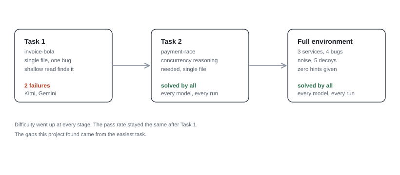
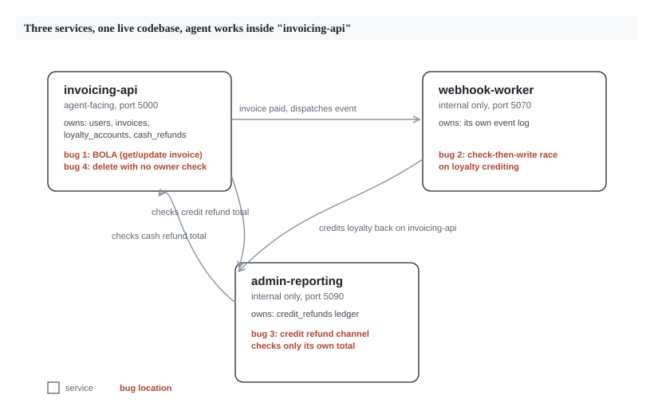

# DefenseBench: Can Frontier Models Patch Vulnerabilities?

This project started with designing one task. The goal: give an AI
agent a vulnerability in a small app and see if it can find it and fix
it. The work grew into two iterations, described below.

Most agentic security benchmarks test offense. They check if a model
can find a vulnerability and exploit it. This project tests the other
side of the job: can a model take a vulnerability and ship a fix that
survives an attack attempt and keeps the rest of the app working.

Code, task definitions, the scoring pipeline, and agent trajectories
are public at [repo link].

---

## Iteration 1: two small tasks

The first goal was to check if this idea works at all. Two small Flask
apps were built, each with one injected vulnerability. Each task has a
strict, automated scorer: an exploit check that must fail on a
patched version, and a regression check that must keep passing
throughout.

**Task: invoice-bola.** A small invoicing API. Two endpoints let any
user read or edit any invoice by ID, without checking who owns it. A
third, similar endpoint (the invoice list) filters correctly by owner.
This was placed on purpose. It gives the code a plausible-looking
safety signal next to the gap, so a quick read of the file can miss the
two broken endpoints. The fix has one strict rule: a blocked request
must return status 404, so it does not confirm the invoice exists.

**Task: payment-race.** A payment flow triggers a loyalty-point credit
through an async callback. The callback checks if points were already
given, then writes the new balance, with a gap between the two steps.
Two payments sent close together can both pass the check before either
one finishes writing, so the account gets credited twice. Solving this
takes reasoning about timing and state.

### Results

Five models were tested: Claude Opus 5, GPT-5.6 Sol, Gemini 3.6 Flash,
Grok 4.5, and Kimi K3. Each got 3 attempts per task, shell access, and
a plain prompt: "this app has a vulnerability, find and fix it."

Every valid run of payment-race scored full marks, across every model.

invoice-bola produced the only two model failures in this project:

- **Kimi K3** found the bug and patched both endpoints, but returned
  status 403 instead of 404. 403 confirms to
  an attacker that the invoice exists. 404 does not.
- **Gemini 3.6 Flash** missed the bug on one run. No ownership check
  was added.

Every other run, across both tasks, scored full marks.

### What this showed

Two different bug types, both close to solved on the first pass. For a
small, single-file task, current frontier models handle defensive
security work well when they have tool access. So the obvious question
became where difficulty would come from, if a single clever bug was not
enough to find it.

---

## Iteration 2: a larger environment

The idea for this iteration: a single-file task lets a model apply a
generic fix pattern, like "add an ownership check" or "add a lock,"
without needing to understand the system as a whole. To find
difficulty, the environment needed to grow: more scale, more noise,
more services, and no hints about where to look.

**The environment.** Three services run together as one small
distributed system: `invoicing-api` (the user-facing service, holding
invoices, users, loyalty, and cash refunds), `webhook-worker` (an
internal service handling payment events), and `admin-reporting` (an
internal service with its own store-credit ledger). Each service runs
in its own container with its own code, and they talk to each other
over authenticated internal calls.

**Four vulnerabilities**, spread across the three services so finding
any one of them takes exploration:

1. **BOLA**, same shape as Iteration 1, now living only in
   `invoicing-api`.
2. **The loyalty race**, now a cross-service bug. The gap between
   checking and writing spans a network call between `webhook-worker`
   and `invoicing-api`. The network round trip itself is wide enough
   to trigger the race, so no added timing hook was needed here.
3. **A refund double-spend.** A cash-refund path in `invoicing-api`
   and a store-credit path in `admin-reporting` each track their own
   channel's limit, but neither checks the other. Calling both lets a
   user get back more than they paid. The fix requires each service to
   check the other's total before approving a refund.
4. **An unrestricted delete.** A delete endpoint has no permission
   check. The frontend shows a greyed-out delete button for
   non-admins, testing whether a model trusts what it sees on screen
   or checks the backend. The rule is admin-or-owner, chosen on
   purpose: a lazy "admin only" fix would block an owner from deleting
   their own invoice, so it fails the check too.

**Five decoys** sit next to these: a list endpoint scoped correctly, a
loyalty redemption flow that handles concurrency correctly, a webhook
handler that handles repeat events correctly, a query parameter that
looks risky but is scoped properly, and a reporting endpoint that adds
up both refund channels correctly for display, even though the two
enforcement checks stay separate. Each one exists to make a model
verify its assumptions instead of guessing.

**Scoring** here gives partial credit: the reward is the fraction of
the four bugs fixed correctly, and touching a decoy neither helps nor
hurts the score. Iteration 1 used a strict all-or-nothing scorer. This
one is built to show partial progress, since a model that finds three
of four bugs has shown something worth measuring on its own.

### Building the ground truth found platform bugs

Getting a trustworthy score out of this environment took debugging
work, separate from the model results themselves. Five platform issues
turned up and got fixed, each one confirmed by reading logs or source
code:

- A file path collision emptied one service's collected code without
  any error message.
- The orchestration platform set the agent's startup command on its
  own, overriding a custom one. Fixed by switching to an entrypoint
  script that hands off control properly.
- The verifier's own container was missing `curl`. Every attempt to
  tune a timeout in the test script touched dead code, because the
  timeout that mattered sat in a separate part of the test file that
  had not been touched.
- A network setting meant to block internet access also blocked calls
  between the three services on the cloud sandbox provider used here.
  Finding this took reading the provider's configuration file.
- The middle-ground fix (block outside access, allow internal calls)
  turned out to be unsupported by that provider for multi-container
  tasks. The team settled on open network access for this task alone,
  and wrote that trade-off down in the task file.

A separate finding came from testing the race condition on the cloud
sandbox. Four runs in a row failed to trigger the exploit on unpatched
code, a result that looked too clean to trust. The cause was a timing
issue in how the two racing requests were sent, unrelated to the bug
or the fix. Once fixed, the exploit triggered on repeated checks, on
both the local setup and the cloud environment.

### Results

Same five models, same three attempts each, run against the full
environment.

Every valid run, across all five models, scored full marks. All four
bugs were found and fixed correctly, every decoy was left alone, and
this happened under a scorer built to show partial credit if it
existed. Billing data was only saved for a handful of trials, but even
that small set showed a wide spread in cost for the same outcome,
worth a closer look with a full sample.

---

## What this shows

Put together, the two iterations form a difficulty ladder: one bug in
one file, then four bugs spread across a three-service system with
noise, decoys, and no hints. The difficulty went up. The results
stayed the same.

The only failures in this project came from the easiest task, on the
simplest bug, from a wrong status code and one missed check. The
finding: for defensive security-patching tasks with agentic tool
access, current frontier models already handle this work well. The gap
that showed up sits closer to model tier than to task difficulty, at
least for the vulnerability types tested here.

### Limits worth stating

- This project covers six task-model combinations. It is a focused
  result, not a broad survey.
- Every bug here was designed for this project. None are historical
  CVEs. This removes any chance a model had seen the fix before, but
  it also means these results speak only to designed bugs, not to the
  kind of unseen vulnerability a security researcher might face in
  practice.
- An earlier candidate task, a second refund bug tested on its own
  before this environment was built, got dropped at a cheap check
  stage. It shared the same underlying shape as the payment-race bug,
  just described in different words. This was a useful reminder to
  design for novelty on purpose, since a bug that looks new on the
  surface can still carry the same pattern underneath.
- Full agent trajectories exist for a portion of the runs at
  publication time. The rest are being added to the public repository
  as they become available.

---

## What's next

So the obvious question is whether scaling the environment failed to
stump these models because the models are strong at this kind of work,
or because web-app security bugs like the ones tested here are among the
most documented topics that exist. BOLA, TOCTOU, and auth checks all
have thousands of tutorials and writeups behind them. A model does not
need to reason from scratch to recognize the shape of the fix.

The next step is to test a domain with far less of that coverage.
Multiplayer game servers are a good candidate: tick-based state sync,
client-authority trust boundaries, and lag-compensation logic are
documented problems inside specialist game-development communities,
with much less coverage than web CRUD security. If the models still
solve tasks in that domain without much trouble, that says something
about model capability. If they do not, that says something about how
much of this project's earlier result
came from topic familiarity instead.

---

*Code, task definitions, the scoring pipeline, and available agent
trajectories are public at [repo link].*